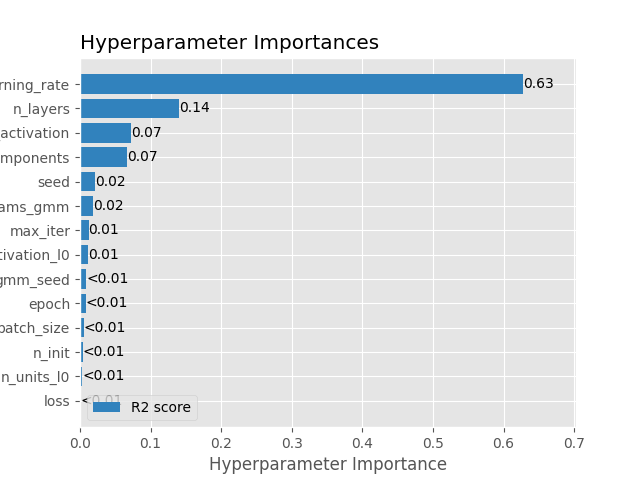
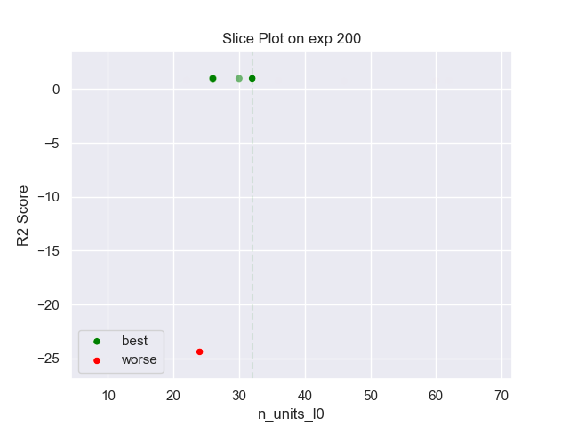
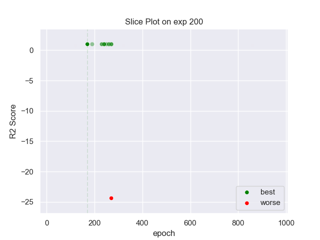
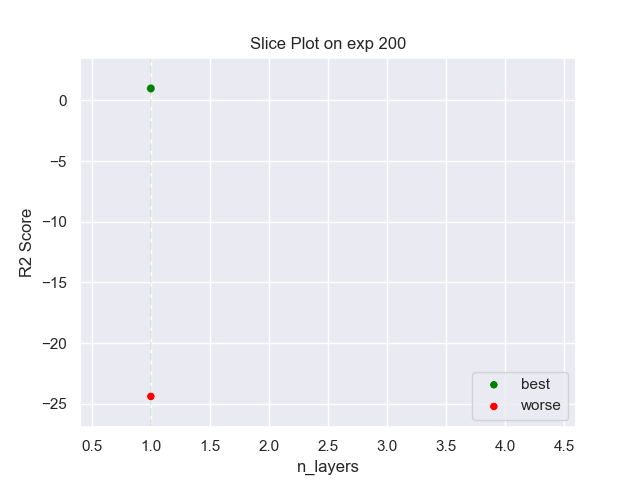
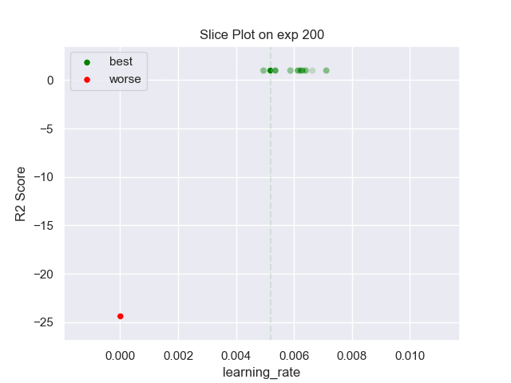
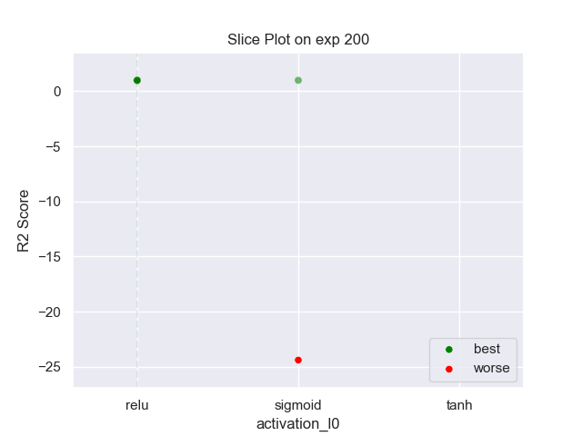
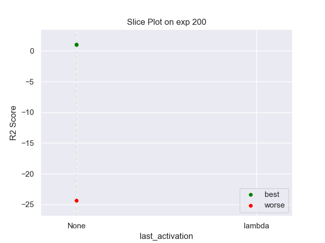
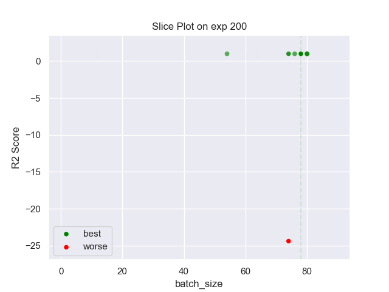
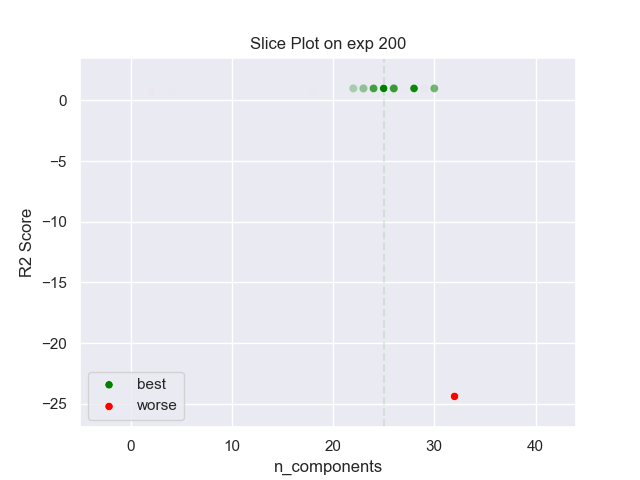

## MLP GMM 200 exp

### TOP 3
- R2 score: **0.99772105**
	 - **seed** : *18*
	 - **n_init** : *90*
	 - **max_iter** : *40*
	 - **n_components** : *25*
	 - **gmm_seed** : *64*
	 - **init_params_gmm** : *random*
	 - **n_layers** : *1*
	 - **n_units_l0** : *32*
	 - **activation_l0** : *relu*
	 - **last_activation** : *None*
	 - **learning_rate** : *0.00519*
	 - **epoch** : *170*
	 - **loss** : *huber_loss*
	 - **batch_size** : *78*

- R2 score: **0.99732989**
	 - **seed** : *12*
	 - **n_init** : *100*
	 - **max_iter** : *60*
	 - **n_components** : *28*
	 - **gmm_seed** : *45*
	 - **init_params_gmm** : *random*
	 - **n_layers** : *1*
	 - **n_units_l0** : *26*
	 - **activation_l0** : *relu*
	 - **last_activation** : *None*
	 - **learning_rate** : *0.0062900000000000005*
	 - **epoch** : *240*
	 - **loss** : *mse_loss*
	 - **batch_size** : *74*

- R2 score: **0.996828**
	 - **seed** : *12*
	 - **n_init** : *100*
	 - **max_iter** : *50*
	 - **n_components** : *24*
	 - **gmm_seed** : *56*
	 - **init_params_gmm** : *random*
	 - **n_layers** : *1*
	 - **n_units_l0** : *26*
	 - **activation_l0** : *relu*
	 - **last_activation** : *None*
	 - **learning_rate** : *0.00536*
	 - **epoch** : *230*
	 - **loss** : *mse_loss*
	 - **batch_size** : *76*

### WORST 3
- R2 score: **-24.40140009**
	 - **seed** : *18*
	 - **n_init** : *90*
	 - **max_iter** : *40*
	 - **n_components** : *25*
	 - **gmm_seed** : *64*
	 - **init_params_gmm** : *random*
	 - **n_layers** : *1*
	 - **n_units_l0** : *32*
	 - **activation_l0** : *relu*
	 - **last_activation** : *None*
	 - **learning_rate** : *0.00519*
	 - **epoch** : *170*
	 - **loss** : *huber_loss*
	 - **batch_size** : *78*

- R2 score: **0.73877475**
	 - **seed** : *12*
	 - **n_init** : *100*
	 - **max_iter** : *60*
	 - **n_components** : *28*
	 - **gmm_seed** : *45*
	 - **init_params_gmm** : *random*
	 - **n_layers** : *1*
	 - **n_units_l0** : *26*
	 - **activation_l0** : *relu*
	 - **last_activation** : *None*
	 - **learning_rate** : *0.0062900000000000005*
	 - **epoch** : *240*
	 - **loss** : *mse_loss*
	 - **batch_size** : *74*

- R2 score: **0.7646683**
	 - **seed** : *12*
	 - **n_init** : *100*
	 - **max_iter** : *50*
	 - **n_components** : *24*
	 - **gmm_seed** : *56*
	 - **init_params_gmm** : *random*
	 - **n_layers** : *1*
	 - **n_units_l0** : *26*
	 - **activation_l0** : *relu*
	 - **last_activation** : *None*
	 - **learning_rate** : *0.00536*
	 - **epoch** : *230*
	 - **loss** : *mse_loss*
	 - **batch_size** : *76*

