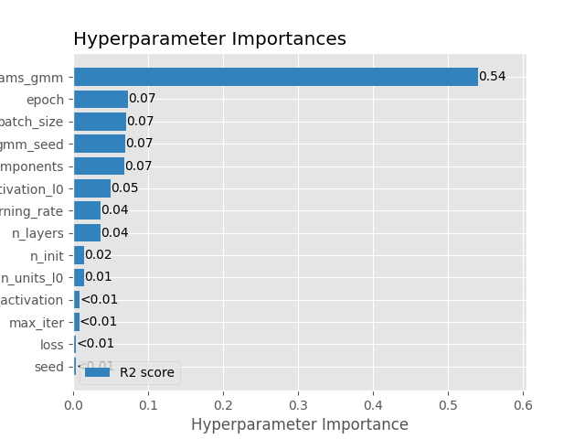
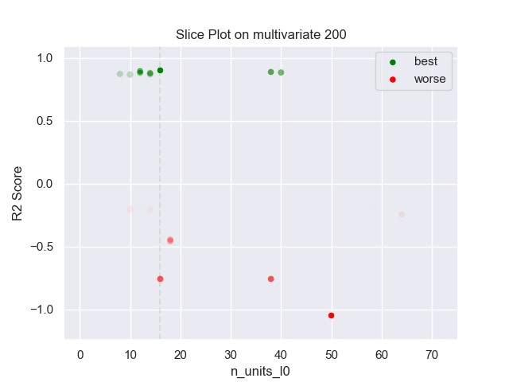
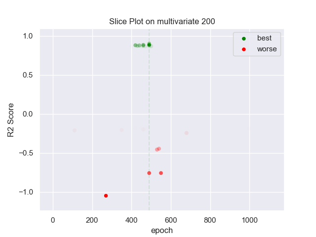
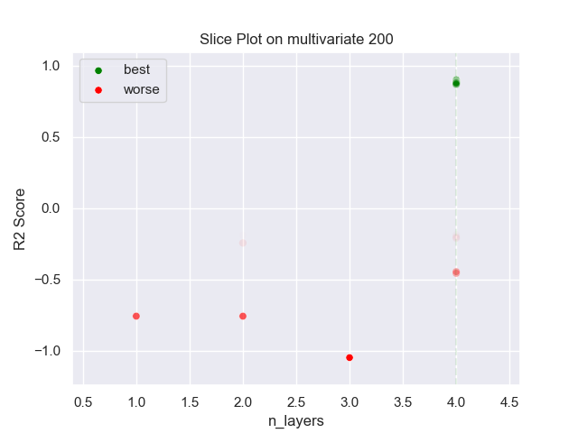
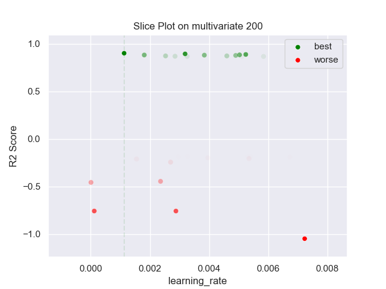
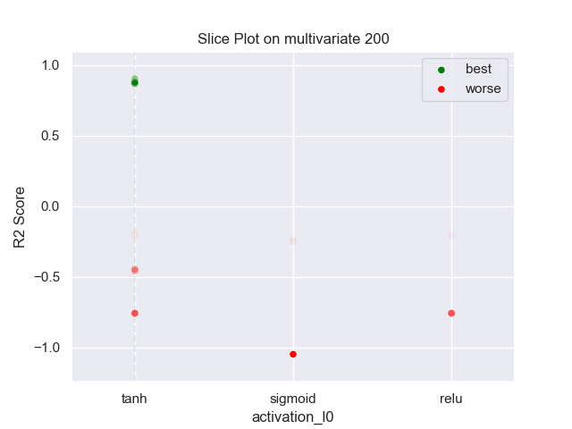
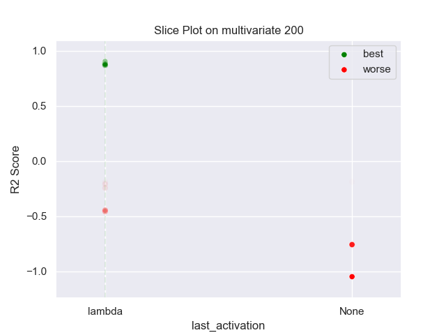
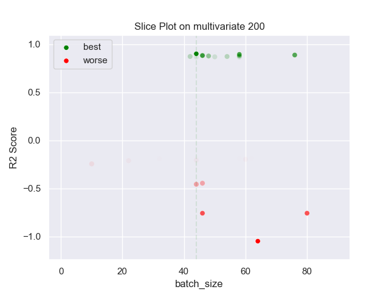
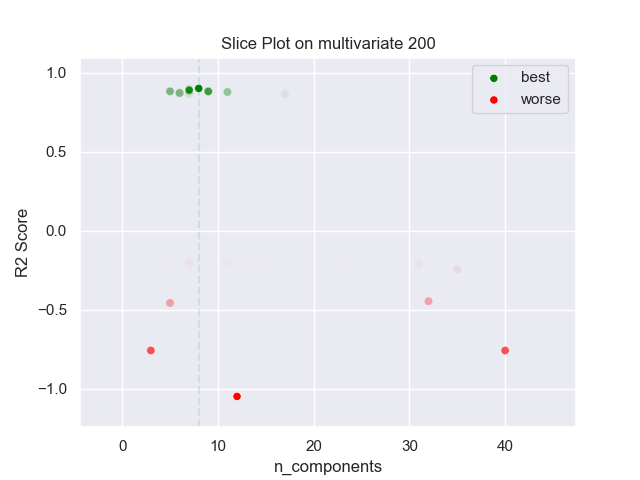

## MLP GMM 200 multivariate

### TOP 3
- R2 score: **0.89964418**
	 - **seed** : *74*
	 - **n_init** : *100*
	 - **max_iter** : *80*
	 - **n_components** : *8*
	 - **gmm_seed** : *76*
	 - **init_params_gmm** : *random_from_data*
	 - **n_layers** : *4*
	 - **n_units_l0** : *16*
	 - **activation_l0** : *tanh*
	 - **n_units_l1** : *40*
	 - **activation_l1** : *tanh*
	 - **n_units_l2** : *54*
	 - **activation_l2** : *relu*
	 - **n_units_l3** : *12*
	 - **activation_l3** : *tanh*
	 - **last_activation** : *lambda*
	 - **learning_rate** : *0.0011300000000000001*
	 - **epoch** : *490*
	 - **loss** : *huber_loss*
	 - **batch_size** : *44*

- R2 score: **0.89292695**
	 - **seed** : *84*
	 - **n_init** : *80*
	 - **max_iter** : *20*
	 - **n_components** : *7*
	 - **gmm_seed** : *2*
	 - **init_params_gmm** : *random_from_data*
	 - **n_layers** : *4*
	 - **n_units_l0** : *12*
	 - **activation_l0** : *tanh*
	 - **n_units_l1** : *40*
	 - **activation_l1** : *tanh*
	 - **n_units_l2** : *60*
	 - **activation_l2** : *tanh*
	 - **n_units_l3** : *14*
	 - **activation_l3** : *tanh*
	 - **last_activation** : *lambda*
	 - **learning_rate** : *0.00319*
	 - **epoch** : *490*
	 - **loss** : *huber_loss*
	 - **batch_size** : *58*

- R2 score: **0.88676263**
	 - **seed** : *82*
	 - **n_init** : *90*
	 - **max_iter** : *20*
	 - **n_components** : *7*
	 - **gmm_seed** : *2*
	 - **init_params_gmm** : *random_from_data*
	 - **n_layers** : *4*
	 - **n_units_l0** : *38*
	 - **activation_l0** : *tanh*
	 - **n_units_l1** : *38*
	 - **activation_l1** : *tanh*
	 - **n_units_l2** : *54*
	 - **activation_l2** : *tanh*
	 - **n_units_l3** : *20*
	 - **activation_l3** : *relu*
	 - **last_activation** : *lambda*
	 - **learning_rate** : *0.00524*
	 - **epoch** : *490*
	 - **loss** : *huber_loss*
	 - **batch_size** : *76*

### WORST 3
- R2 score: **-1.04887012**
	 - **seed** : *74*
	 - **n_init** : *100*
	 - **max_iter** : *80*
	 - **n_components** : *8*
	 - **gmm_seed** : *76*
	 - **init_params_gmm** : *random_from_data*
	 - **n_layers** : *4*
	 - **n_units_l0** : *16*
	 - **activation_l0** : *tanh*
	 - **n_units_l1** : *40*
	 - **activation_l1** : *tanh*
	 - **n_units_l2** : *54*
	 - **activation_l2** : *relu*
	 - **n_units_l3** : *12*
	 - **activation_l3** : *tanh*
	 - **last_activation** : *lambda*
	 - **learning_rate** : *0.0011300000000000001*
	 - **epoch** : *490*
	 - **loss** : *huber_loss*
	 - **batch_size** : *44*

- R2 score: **-0.75852225**
	 - **seed** : *84*
	 - **n_init** : *80*
	 - **max_iter** : *20*
	 - **n_components** : *7*
	 - **gmm_seed** : *2*
	 - **init_params_gmm** : *random_from_data*
	 - **n_layers** : *4*
	 - **n_units_l0** : *12*
	 - **activation_l0** : *tanh*
	 - **n_units_l1** : *40*
	 - **activation_l1** : *tanh*
	 - **n_units_l2** : *60*
	 - **activation_l2** : *tanh*
	 - **n_units_l3** : *14*
	 - **activation_l3** : *tanh*
	 - **last_activation** : *lambda*
	 - **learning_rate** : *0.00319*
	 - **epoch** : *490*
	 - **loss** : *huber_loss*
	 - **batch_size** : *58*

- R2 score: **-0.75825041**
	 - **seed** : *82*
	 - **n_init** : *90*
	 - **max_iter** : *20*
	 - **n_components** : *7*
	 - **gmm_seed** : *2*
	 - **init_params_gmm** : *random_from_data*
	 - **n_layers** : *4*
	 - **n_units_l0** : *38*
	 - **activation_l0** : *tanh*
	 - **n_units_l1** : *38*
	 - **activation_l1** : *tanh*
	 - **n_units_l2** : *54*
	 - **activation_l2** : *tanh*
	 - **n_units_l3** : *20*
	 - **activation_l3** : *relu*
	 - **last_activation** : *lambda*
	 - **learning_rate** : *0.00524*
	 - **epoch** : *490*
	 - **loss** : *huber_loss*
	 - **batch_size** : *76*

