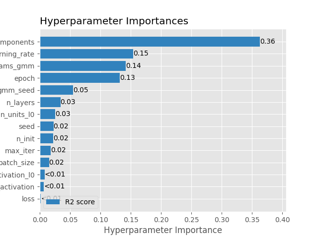
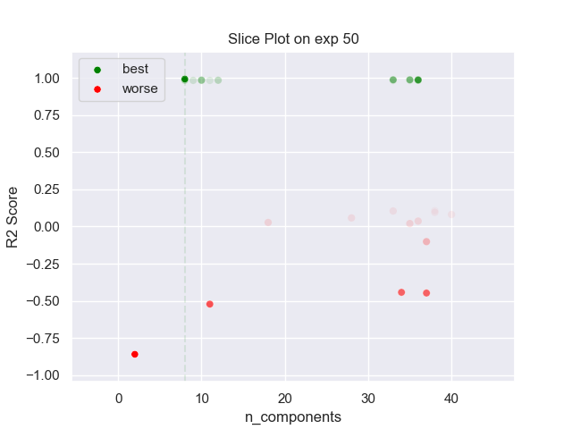

## MLP GMM 50 exp

### TOP 3
- R2 score: **0.9924155**
	 - **seed** : *2*
	 - **n_init** : *30*
	 - **max_iter** : *30*
	 - **n_components** : *8*
	 - **gmm_seed** : *73*
	 - **init_params_gmm** : *k-means++*
	 - **n_layers** : *1*
	 - **n_units_l0** : *26*
	 - **activation_l0** : *sigmoid*
	 - **last_activation** : *None*
	 - **learning_rate** : *0.00924*
	 - **epoch** : *940*
	 - **loss** : *mse_loss*
	 - **batch_size** : *34*

- R2 score: **0.98696431**
	 - **seed** : *24*
	 - **n_init** : *40*
	 - **max_iter** : *80*
	 - **n_components** : *33*
	 - **gmm_seed** : *82*
	 - **init_params_gmm** : *random*
	 - **n_layers** : *1*
	 - **n_units_l0** : *28*
	 - **activation_l0** : *sigmoid*
	 - **last_activation** : *None*
	 - **learning_rate** : *0.00871*
	 - **epoch** : *820*
	 - **loss** : *mse_loss*
	 - **batch_size** : *12*

- R2 score: **0.98694003**
	 - **seed** : *14*
	 - **n_init** : *50*
	 - **max_iter** : *70*
	 - **n_components** : *35*
	 - **gmm_seed** : *71*
	 - **init_params_gmm** : *random*
	 - **n_layers** : *1*
	 - **n_units_l0** : *26*
	 - **activation_l0** : *sigmoid*
	 - **last_activation** : *None*
	 - **learning_rate** : *0.00963*
	 - **epoch** : *710*
	 - **loss** : *mse_loss*
	 - **batch_size** : *20*

### WORST 3
- R2 score: **-0.85957507**
	 - **seed** : *2*
	 - **n_init** : *30*
	 - **max_iter** : *30*
	 - **n_components** : *8*
	 - **gmm_seed** : *73*
	 - **init_params_gmm** : *k-means++*
	 - **n_layers** : *1*
	 - **n_units_l0** : *26*
	 - **activation_l0** : *sigmoid*
	 - **last_activation** : *None*
	 - **learning_rate** : *0.00924*
	 - **epoch** : *940*
	 - **loss** : *mse_loss*
	 - **batch_size** : *34*

- R2 score: **-0.52203476**
	 - **seed** : *24*
	 - **n_init** : *40*
	 - **max_iter** : *80*
	 - **n_components** : *33*
	 - **gmm_seed** : *82*
	 - **init_params_gmm** : *random*
	 - **n_layers** : *1*
	 - **n_units_l0** : *28*
	 - **activation_l0** : *sigmoid*
	 - **last_activation** : *None*
	 - **learning_rate** : *0.00871*
	 - **epoch** : *820*
	 - **loss** : *mse_loss*
	 - **batch_size** : *12*

- R2 score: **-0.44750862**
	 - **seed** : *14*
	 - **n_init** : *50*
	 - **max_iter** : *70*
	 - **n_components** : *35*
	 - **gmm_seed** : *71*
	 - **init_params_gmm** : *random*
	 - **n_layers** : *1*
	 - **n_units_l0** : *26*
	 - **activation_l0** : *sigmoid*
	 - **last_activation** : *None*
	 - **learning_rate** : *0.00963*
	 - **epoch** : *710*
	 - **loss** : *mse_loss*
	 - **batch_size** : *20*

