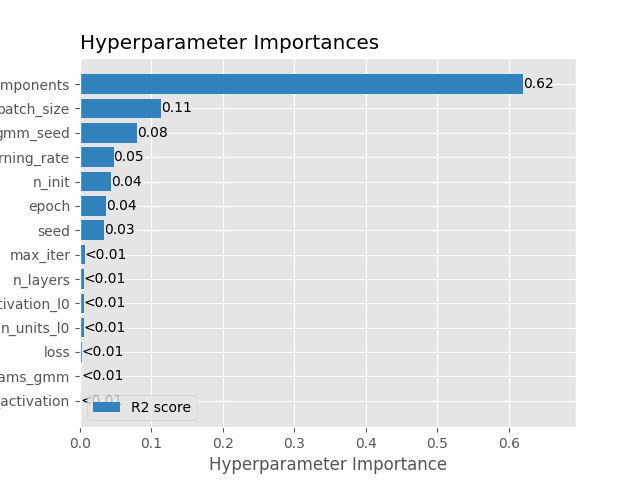
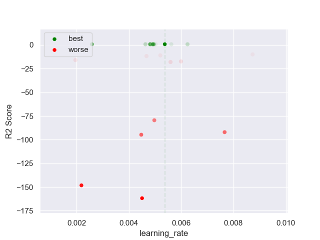
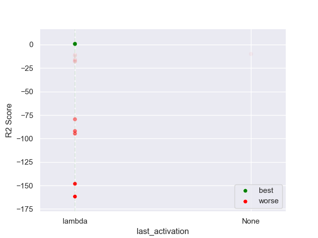

## MLP GMM 50 multivariate

### TOP 3
- R2 score: **0.80336532**
	 - **seed** : *47*
	 - **n_init** : *40*
	 - **max_iter** : *70*
	 - **n_components** : *4*
	 - **gmm_seed** : *14*
	 - **init_params_gmm** : *k-means++*
	 - **n_layers** : *3*
	 - **n_units_l0** : *24*
	 - **activation_l0** : *tanh*
	 - **n_units_l1** : *26*
	 - **activation_l1** : *tanh*
	 - **n_units_l2** : *48*
	 - **activation_l2** : *tanh*
	 - **last_activation** : *lambda*
	 - **learning_rate** : *0.00537*
	 - **epoch** : *910*
	 - **loss** : *mse_loss*
	 - **batch_size** : *44*

- R2 score: **0.76771529**
	 - **seed** : *61*
	 - **n_init** : *50*
	 - **max_iter** : *100*
	 - **n_components** : *6*
	 - **gmm_seed** : *34*
	 - **init_params_gmm** : *k-means++*
	 - **n_layers** : *3*
	 - **n_units_l0** : *8*
	 - **activation_l0** : *relu*
	 - **n_units_l1** : *32*
	 - **activation_l1** : *tanh*
	 - **n_units_l2** : *38*
	 - **activation_l2** : *tanh*
	 - **last_activation** : *lambda*
	 - **learning_rate** : *0.0025800000000000003*
	 - **epoch** : *570*
	 - **loss** : *mse_loss*
	 - **batch_size** : *34*

- R2 score: **0.76536769**
	 - **seed** : *56*
	 - **n_init** : *50*
	 - **max_iter** : *90*
	 - **n_components** : *4*
	 - **gmm_seed** : *3*
	 - **init_params_gmm** : *k-means++*
	 - **n_layers** : *3*
	 - **n_units_l0** : *34*
	 - **activation_l0** : *relu*
	 - **n_units_l1** : *36*
	 - **activation_l1** : *tanh*
	 - **n_units_l2** : *42*
	 - **activation_l2** : *sigmoid*
	 - **last_activation** : *lambda*
	 - **learning_rate** : *0.00481*
	 - **epoch** : *1000*
	 - **loss** : *mse_loss*
	 - **batch_size** : *40*

### WORST 3
- R2 score: **-161.76383327**
	 - **seed** : *47*
	 - **n_init** : *40*
	 - **max_iter** : *70*
	 - **n_components** : *4*
	 - **gmm_seed** : *14*
	 - **init_params_gmm** : *k-means++*
	 - **n_layers** : *3*
	 - **n_units_l0** : *24*
	 - **activation_l0** : *tanh*
	 - **n_units_l1** : *26*
	 - **activation_l1** : *tanh*
	 - **n_units_l2** : *48*
	 - **activation_l2** : *tanh*
	 - **last_activation** : *lambda*
	 - **learning_rate** : *0.00537*
	 - **epoch** : *910*
	 - **loss** : *mse_loss*
	 - **batch_size** : *44*

- R2 score: **-148.17838489**
	 - **seed** : *61*
	 - **n_init** : *50*
	 - **max_iter** : *100*
	 - **n_components** : *6*
	 - **gmm_seed** : *34*
	 - **init_params_gmm** : *k-means++*
	 - **n_layers** : *3*
	 - **n_units_l0** : *8*
	 - **activation_l0** : *relu*
	 - **n_units_l1** : *32*
	 - **activation_l1** : *tanh*
	 - **n_units_l2** : *38*
	 - **activation_l2** : *tanh*
	 - **last_activation** : *lambda*
	 - **learning_rate** : *0.0025800000000000003*
	 - **epoch** : *570*
	 - **loss** : *mse_loss*
	 - **batch_size** : *34*

- R2 score: **-94.74463689**
	 - **seed** : *56*
	 - **n_init** : *50*
	 - **max_iter** : *90*
	 - **n_components** : *4*
	 - **gmm_seed** : *3*
	 - **init_params_gmm** : *k-means++*
	 - **n_layers** : *3*
	 - **n_units_l0** : *34*
	 - **activation_l0** : *relu*
	 - **n_units_l1** : *36*
	 - **activation_l1** : *tanh*
	 - **n_units_l2** : *42*
	 - **activation_l2** : *sigmoid*
	 - **last_activation** : *lambda*
	 - **learning_rate** : *0.00481*
	 - **epoch** : *1000*
	 - **loss** : *mse_loss*
	 - **batch_size** : *40*

