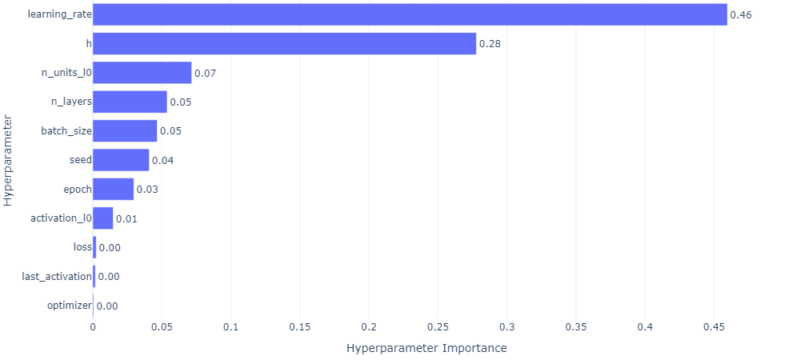

## MLP GMM 10 EXP

### top 3

- MLP_GMM_10_EXP **0.9622483**

  - seed: 62, n_init: 70, max_iter: 80, n_components: 2, gmm_seed: 85, init_params_gmm: k-means++, n_layers: 3, n_units_l0: 20, activation_l0: sigmoid, n_units_l1: 58, activation_l1: sigmoid, n_units_l2: 24, activation_l2: sigmoid, last_activation: lambda, learning_rate: 0.000499492919145958, epoch: 280, optimizer: RMSprop, loss: huber_loss, batch_size: 38seed: 62, n_init: 70, max_iter: 80, n_components: 2, gmm_seed: 85, init_params_gmm: k-means++, n_layers: 3, n_units_l0: 20, activation_l0: sigmoid, n_units_l1: 58, activation_l1: sigmoid, n_units_l2: 24, activation_l2: sigmoid, last_activation: lambda, learning_rate: 0.000499492919145958, epoch: 280, optimizer: RMSprop, loss: huber_loss, batch_size: 38

- MLP_GMM_10_EXP **0.9305**

  - seed 36, n_init 40, max_iter 90, n_components 4, gmm_seed 42, init_params_gmm random_from_data, n_layers 3, n_units_l0 24, activation_l0 sigmoid, n_units_l1 12, activation_l1 relu, n_units_l2 10, activation_l2 relu, last_activation None, learning_rate 0.0004922338743923451, epoch 540, optimizer Adam, loss mse_loss, batch_size 34,

- MLP_GNN_10_MULTIVARIATE
