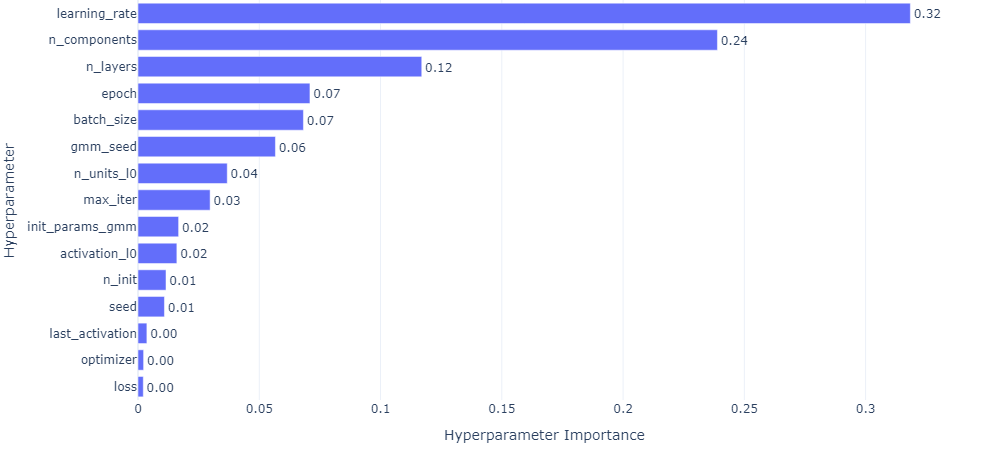

## MLP GMM 10 MULTIVARIATE

### top 3

- (165) **0.77686941**

  - seed 82
    n_init 80
    max_iter 40
    n_components 5
    gmm_seed 34
    init_params_gmm random
    n_layers 3
    n_units_l0 20
    activation_l0 sigmoid
    n_units_l1 12
    activation_l1 relu
    n_units_l2 62
    activation_l2 relu
    last_activation lambda
    learning_rate 0.001005087191794328
    epoch 570
    optimizer RMSprop
    loss huber_loss
    batch_size 74

- (288) **0.7690074**

  - seed 32
    n_init 40
    max_iter 50
    n_components 4
    gmm_seed 28
    init_params_gmm random_from_data
    n_layers 3
    n_units_l0 24
    activation_l0 relu
    n_units_l1 58
    activation_l1 sigmoid
    n_units_l2 30
    activation_l2 tanh
    last_activation lambda
    learning_rate 0.00037900692262173187
    epoch 730
    optimizer RMSprop
    loss huber_loss
    batch_size 68

- (299) **0.7624017**
  - seed 30
    n_init 40
    max_iter 50
    n_components 4
    gmm_seed 24
    init_params_gmm random_from_data
    n_layers 3
    n_units_l0 26
    activation_l0 relu
    n_units_l1 56
    activation_l1 sigmoid
    n_units_l2 30
    activation_l2 tanh
    last_activation lambda
    learning_rate 0.00020894826768890919
    epoch 750
    optimizer RMSprop
    loss huber_loss
    batch_size 68

### worse 3

- (20) **-166.2769207**

  - seed 75
    n_init 90
    max_iter 90
    n_components 7
    gmm_seed 23
    init_params_gmm kmeans
    n_layers 1
    n_units_l0 44
    activation_l0 tanh
    last_activation lambda
    learning_rate 1.0295370787335814e-05
    epoch 460
    optimizer Adam
    loss huber_loss
    batch_size 26

- (3) **-435.18606581**

  - seed 81
    n_init 50
    max_iter 30
    n_components 3
    gmm_seed 51
    init_params_gmm k-means++
    n_layers 1
    n_units_l0 64
    activation_l0 tanh
    last_activation None
    learning_rate 0.06115365077524452
    epoch 900
    optimizer RMSprop
    loss huber_loss
    batch_size 34

- (9) **-1834.85697294**
  - seed 44
    n_init 70
    max_iter 70
    n_components 9
    gmm_seed 59
    init_params_gmm k-means++
    n_layers 1
    n_units_l0 12
    activation_l0 relu
    last_activation None
    learning_rate 3.934715683749499e-05
    epoch 530
    optimizer Adam
    loss huber_loss
    batch_size 58
