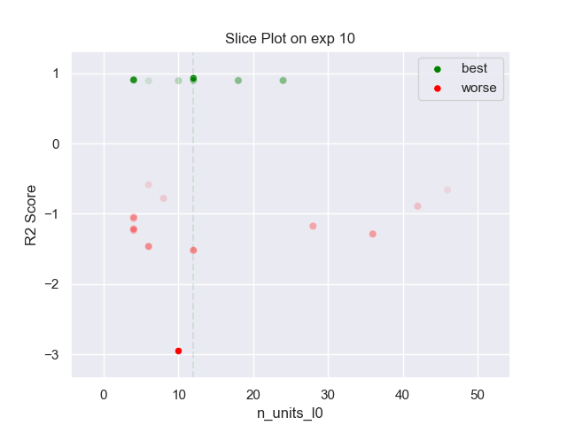
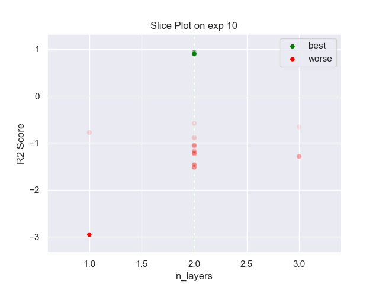

## MLP PARZEN 10 exp

### TOP 3
- R2 score: **0.92841585**
	 - **seed** : *11*
	 - **h** : *0.09085668630067516*
	 - **n_layers** : *2*
	 - **n_units_l0** : *12*
	 - **activation_l0** : *tanh*
	 - **n_units_l1** : *52*
	 - **activation_l1** : *relu*
	 - **last_activation** : *None*
	 - **learning_rate** : *0.0005300000000000001*
	 - **epoch** : *170*
	 - **loss** : *mse_loss*
	 - **batch_size** : *56*

- R2 score: **0.9092378**
	 - **seed** : *6*
	 - **h** : *0.12729759065368032*
	 - **n_layers** : *2*
	 - **n_units_l0** : *4*
	 - **activation_l0** : *tanh*
	 - **n_units_l1** : *52*
	 - **activation_l1** : *relu*
	 - **last_activation** : *None*
	 - **learning_rate** : *0.0008300000000000001*
	 - **epoch** : *250*
	 - **loss** : *mse_loss*
	 - **batch_size** : *76*

- R2 score: **0.90806534**
	 - **seed** : *1*
	 - **h** : *0.12717246403180638*
	 - **n_layers** : *2*
	 - **n_units_l0** : *4*
	 - **activation_l0** : *tanh*
	 - **n_units_l1** : *50*
	 - **activation_l1** : *relu*
	 - **last_activation** : *None*
	 - **learning_rate** : *0.0017500000000000003*
	 - **epoch** : *130*
	 - **loss** : *mse_loss*
	 - **batch_size** : *54*

### WORST 3
- R2 score: **-2.95454495**
	 - **seed** : *11*
	 - **h** : *0.09085668630067516*
	 - **n_layers** : *2*
	 - **n_units_l0** : *12*
	 - **activation_l0** : *tanh*
	 - **n_units_l1** : *52*
	 - **activation_l1** : *relu*
	 - **last_activation** : *None*
	 - **learning_rate** : *0.0005300000000000001*
	 - **epoch** : *170*
	 - **loss** : *mse_loss*
	 - **batch_size** : *56*

- R2 score: **-1.52093753**
	 - **seed** : *6*
	 - **h** : *0.12729759065368032*
	 - **n_layers** : *2*
	 - **n_units_l0** : *4*
	 - **activation_l0** : *tanh*
	 - **n_units_l1** : *52*
	 - **activation_l1** : *relu*
	 - **last_activation** : *None*
	 - **learning_rate** : *0.0008300000000000001*
	 - **epoch** : *250*
	 - **loss** : *mse_loss*
	 - **batch_size** : *76*

- R2 score: **-1.46591513**
	 - **seed** : *1*
	 - **h** : *0.12717246403180638*
	 - **n_layers** : *2*
	 - **n_units_l0** : *4*
	 - **activation_l0** : *tanh*
	 - **n_units_l1** : *50*
	 - **activation_l1** : *relu*
	 - **last_activation** : *None*
	 - **learning_rate** : *0.0017500000000000003*
	 - **epoch** : *130*
	 - **loss** : *mse_loss*
	 - **batch_size** : *54*

