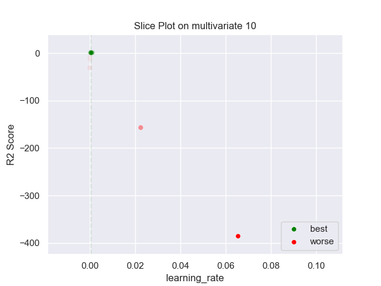
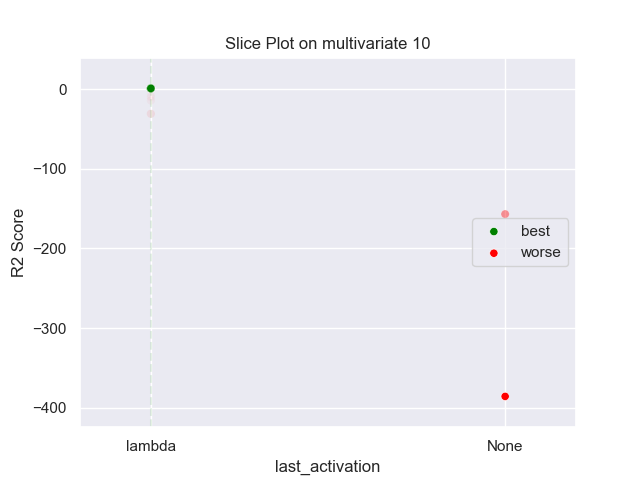

## MLP PARZEN 10 multivariate

### TOP 3
- R2 score: **0.77922271**
	 - **seed** : *44*
	 - **h** : *0.943425509758125*
	 - **n_layers** : *3*
	 - **n_units_l0** : *42*
	 - **activation_l0** : *relu*
	 - **n_units_l1** : *48*
	 - **activation_l1** : *tanh*
	 - **n_units_l2** : *14*
	 - **activation_l2** : *tanh*
	 - **last_activation** : *lambda*
	 - **learning_rate** : *0.0005046691303549016*
	 - **epoch** : *480*
	 - **optimizer** : *RMSprop*
	 - **loss** : *huber_loss*
	 - **batch_size** : *60*

- R2 score: **0.77647528**
	 - **seed** : *50*
	 - **h** : *0.9994943817774465*
	 - **n_layers** : *3*
	 - **n_units_l0** : *44*
	 - **activation_l0** : *relu*
	 - **n_units_l1** : *52*
	 - **activation_l1** : *sigmoid*
	 - **n_units_l2** : *16*
	 - **activation_l2** : *tanh*
	 - **last_activation** : *lambda*
	 - **learning_rate** : *0.0007756361729834524*
	 - **epoch** : *510*
	 - **optimizer** : *RMSprop*
	 - **loss** : *mse_loss*
	 - **batch_size** : *68*

- R2 score: **0.77627734**
	 - **seed** : *41*
	 - **h** : *0.9836548432359916*
	 - **n_layers** : *3*
	 - **n_units_l0** : *46*
	 - **activation_l0** : *relu*
	 - **n_units_l1** : *52*
	 - **activation_l1** : *sigmoid*
	 - **n_units_l2** : *14*
	 - **activation_l2** : *tanh*
	 - **last_activation** : *lambda*
	 - **learning_rate** : *0.0007064604284045984*
	 - **epoch** : *530*
	 - **optimizer** : *RMSprop*
	 - **loss** : *huber_loss*
	 - **batch_size** : *70*

### WORST 3
- R2 score: **-385.63438138**
	 - **seed** : *44*
	 - **h** : *0.943425509758125*
	 - **n_layers** : *3*
	 - **n_units_l0** : *42*
	 - **activation_l0** : *relu*
	 - **n_units_l1** : *48*
	 - **activation_l1** : *tanh*
	 - **n_units_l2** : *14*
	 - **activation_l2** : *tanh*
	 - **last_activation** : *lambda*
	 - **learning_rate** : *0.0005046691303549016*
	 - **epoch** : *480*
	 - **optimizer** : *RMSprop*
	 - **loss** : *huber_loss*
	 - **batch_size** : *60*

- R2 score: **-156.94413191**
	 - **seed** : *50*
	 - **h** : *0.9994943817774465*
	 - **n_layers** : *3*
	 - **n_units_l0** : *44*
	 - **activation_l0** : *relu*
	 - **n_units_l1** : *52*
	 - **activation_l1** : *sigmoid*
	 - **n_units_l2** : *16*
	 - **activation_l2** : *tanh*
	 - **last_activation** : *lambda*
	 - **learning_rate** : *0.0007756361729834524*
	 - **epoch** : *510*
	 - **optimizer** : *RMSprop*
	 - **loss** : *mse_loss*
	 - **batch_size** : *68*

- R2 score: **-31.03267135**
	 - **seed** : *41*
	 - **h** : *0.9836548432359916*
	 - **n_layers** : *3*
	 - **n_units_l0** : *46*
	 - **activation_l0** : *relu*
	 - **n_units_l1** : *52*
	 - **activation_l1** : *sigmoid*
	 - **n_units_l2** : *14*
	 - **activation_l2** : *tanh*
	 - **last_activation** : *lambda*
	 - **learning_rate** : *0.0007064604284045984*
	 - **epoch** : *530*
	 - **optimizer** : *RMSprop*
	 - **loss** : *huber_loss*
	 - **batch_size** : *70*

