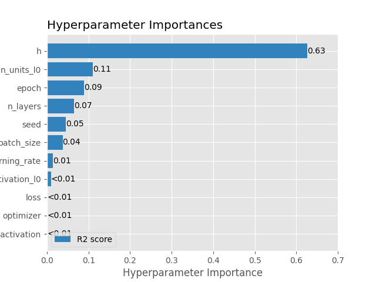
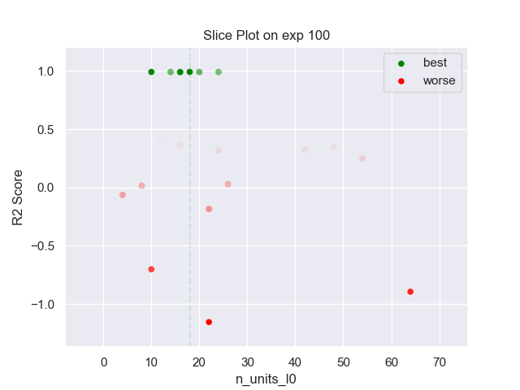
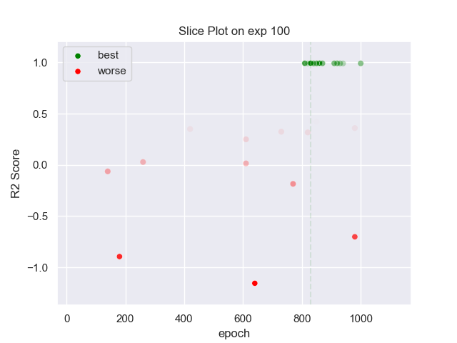
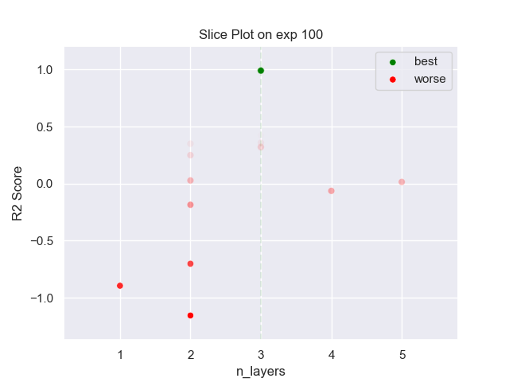
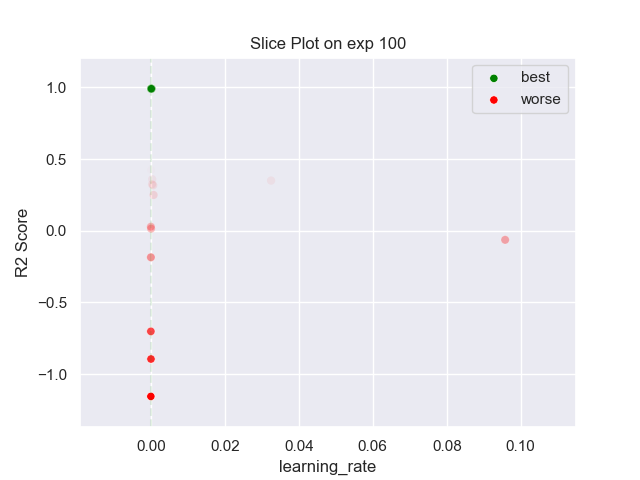
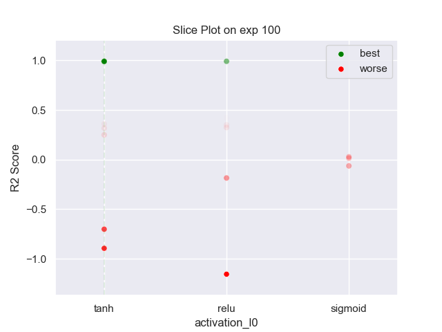
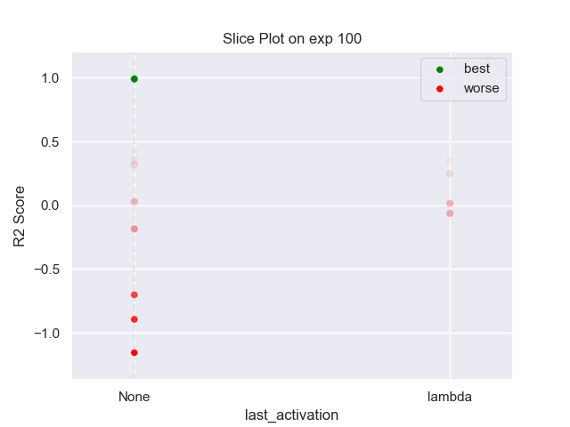
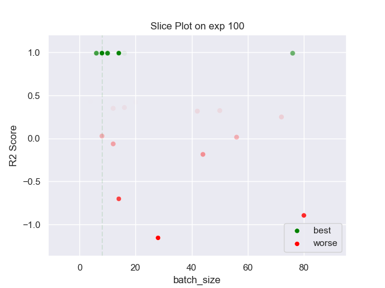
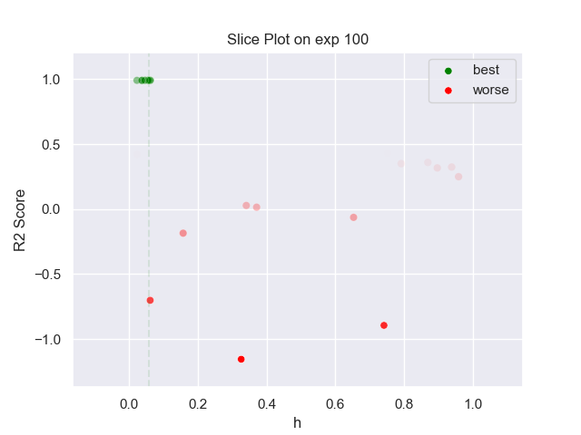

## MLP PARZEN 100 exp

### TOP 3
- R2 score: **0.99333811**
	 - **seed** : *61*
	 - **h** : *0.05856210430161586*
	 - **n_layers** : *3*
	 - **n_units_l0** : *18*
	 - **activation_l0** : *tanh*
	 - **n_units_l1** : *4*
	 - **activation_l1** : *tanh*
	 - **n_units_l2** : *20*
	 - **activation_l2** : *tanh*
	 - **last_activation** : *None*
	 - **learning_rate** : *0.00012072567420347627*
	 - **epoch** : *830*
	 - **optimizer** : *Adam*
	 - **loss** : *mse_loss*
	 - **batch_size** : *8*

- R2 score: **0.99303731**
	 - **seed** : *61*
	 - **h** : *0.04808421285159051*
	 - **n_layers** : *3*
	 - **n_units_l0** : *10*
	 - **activation_l0** : *tanh*
	 - **n_units_l1** : *14*
	 - **activation_l1** : *tanh*
	 - **n_units_l2** : *24*
	 - **activation_l2** : *tanh*
	 - **last_activation** : *None*
	 - **learning_rate** : *9.024746608973285e-05*
	 - **epoch** : *860*
	 - **optimizer** : *Adam*
	 - **loss** : *mse_loss*
	 - **batch_size** : *14*

- R2 score: **0.99234516**
	 - **seed** : *57*
	 - **h** : *0.055770020281759265*
	 - **n_layers** : *3*
	 - **n_units_l0** : *16*
	 - **activation_l0** : *tanh*
	 - **n_units_l1** : *16*
	 - **activation_l1** : *tanh*
	 - **n_units_l2** : *24*
	 - **activation_l2** : *tanh*
	 - **last_activation** : *None*
	 - **learning_rate** : *0.0001186133568476282*
	 - **epoch** : *810*
	 - **optimizer** : *Adam*
	 - **loss** : *mse_loss*
	 - **batch_size** : *8*

### WORST 3
- R2 score: **-1.15597519**
	 - **seed** : *61*
	 - **h** : *0.05856210430161586*
	 - **n_layers** : *3*
	 - **n_units_l0** : *18*
	 - **activation_l0** : *tanh*
	 - **n_units_l1** : *4*
	 - **activation_l1** : *tanh*
	 - **n_units_l2** : *20*
	 - **activation_l2** : *tanh*
	 - **last_activation** : *None*
	 - **learning_rate** : *0.00012072567420347627*
	 - **epoch** : *830*
	 - **optimizer** : *Adam*
	 - **loss** : *mse_loss*
	 - **batch_size** : *8*

- R2 score: **-0.89511649**
	 - **seed** : *61*
	 - **h** : *0.04808421285159051*
	 - **n_layers** : *3*
	 - **n_units_l0** : *10*
	 - **activation_l0** : *tanh*
	 - **n_units_l1** : *14*
	 - **activation_l1** : *tanh*
	 - **n_units_l2** : *24*
	 - **activation_l2** : *tanh*
	 - **last_activation** : *None*
	 - **learning_rate** : *9.024746608973285e-05*
	 - **epoch** : *860*
	 - **optimizer** : *Adam*
	 - **loss** : *mse_loss*
	 - **batch_size** : *14*

- R2 score: **-0.70219577**
	 - **seed** : *57*
	 - **h** : *0.055770020281759265*
	 - **n_layers** : *3*
	 - **n_units_l0** : *16*
	 - **activation_l0** : *tanh*
	 - **n_units_l1** : *16*
	 - **activation_l1** : *tanh*
	 - **n_units_l2** : *24*
	 - **activation_l2** : *tanh*
	 - **last_activation** : *None*
	 - **learning_rate** : *0.0001186133568476282*
	 - **epoch** : *810*
	 - **optimizer** : *Adam*
	 - **loss** : *mse_loss*
	 - **batch_size** : *8*

