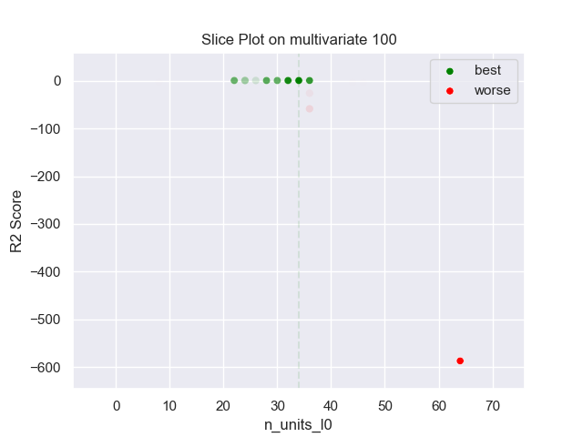
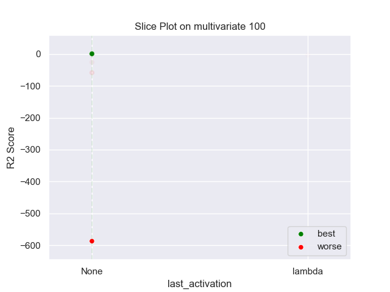

## MLP PARZEN 100 multivariate

### TOP 3
- R2 score: **0.90120015**
	 - **seed** : *98*
	 - **h** : *0.2631334377419931*
	 - **n_layers** : *5*
	 - **n_units_l0** : *34*
	 - **activation_l0** : *relu*
	 - **n_units_l1** : *30*
	 - **activation_l1** : *tanh*
	 - **n_units_l2** : *22*
	 - **activation_l2** : *relu*
	 - **n_units_l3** : *52*
	 - **activation_l3** : *relu*
	 - **n_units_l4** : *24*
	 - **activation_l4** : *sigmoid*
	 - **last_activation** : *None*
	 - **learning_rate** : *0.0024196704886789663*
	 - **epoch** : *350*
	 - **optimizer** : *Adam*
	 - **loss** : *huber_loss*
	 - **batch_size** : *68*

- R2 score: **0.89812005**
	 - **seed** : *95*
	 - **h** : *0.23899931768525698*
	 - **n_layers** : *5*
	 - **n_units_l0** : *32*
	 - **activation_l0** : *relu*
	 - **n_units_l1** : *36*
	 - **activation_l1** : *tanh*
	 - **n_units_l2** : *20*
	 - **activation_l2** : *relu*
	 - **n_units_l3** : *50*
	 - **activation_l3** : *relu*
	 - **n_units_l4** : *24*
	 - **activation_l4** : *sigmoid*
	 - **last_activation** : *None*
	 - **learning_rate** : *0.0023299996468585677*
	 - **epoch** : *320*
	 - **optimizer** : *Adam*
	 - **loss** : *huber_loss*
	 - **batch_size** : *72*

- R2 score: **0.89774166**
	 - **seed** : *90*
	 - **h** : *0.23247745675204673*
	 - **n_layers** : *5*
	 - **n_units_l0** : *36*
	 - **activation_l0** : *relu*
	 - **n_units_l1** : *22*
	 - **activation_l1** : *tanh*
	 - **n_units_l2** : *20*
	 - **activation_l2** : *relu*
	 - **n_units_l3** : *48*
	 - **activation_l3** : *relu*
	 - **n_units_l4** : *30*
	 - **activation_l4** : *tanh*
	 - **last_activation** : *None*
	 - **learning_rate** : *0.0023233599583199157*
	 - **epoch** : *330*
	 - **optimizer** : *Adam*
	 - **loss** : *mse_loss*
	 - **batch_size** : *70*

### WORST 3
- R2 score: **-587.27056895**
	 - **seed** : *98*
	 - **h** : *0.2631334377419931*
	 - **n_layers** : *5*
	 - **n_units_l0** : *34*
	 - **activation_l0** : *relu*
	 - **n_units_l1** : *30*
	 - **activation_l1** : *tanh*
	 - **n_units_l2** : *22*
	 - **activation_l2** : *relu*
	 - **n_units_l3** : *52*
	 - **activation_l3** : *relu*
	 - **n_units_l4** : *24*
	 - **activation_l4** : *sigmoid*
	 - **last_activation** : *None*
	 - **learning_rate** : *0.0024196704886789663*
	 - **epoch** : *350*
	 - **optimizer** : *Adam*
	 - **loss** : *huber_loss*
	 - **batch_size** : *68*

- R2 score: **-58.48369888**
	 - **seed** : *95*
	 - **h** : *0.23899931768525698*
	 - **n_layers** : *5*
	 - **n_units_l0** : *32*
	 - **activation_l0** : *relu*
	 - **n_units_l1** : *36*
	 - **activation_l1** : *tanh*
	 - **n_units_l2** : *20*
	 - **activation_l2** : *relu*
	 - **n_units_l3** : *50*
	 - **activation_l3** : *relu*
	 - **n_units_l4** : *24*
	 - **activation_l4** : *sigmoid*
	 - **last_activation** : *None*
	 - **learning_rate** : *0.0023299996468585677*
	 - **epoch** : *320*
	 - **optimizer** : *Adam*
	 - **loss** : *huber_loss*
	 - **batch_size** : *72*

- R2 score: **-25.75835683**
	 - **seed** : *90*
	 - **h** : *0.23247745675204673*
	 - **n_layers** : *5*
	 - **n_units_l0** : *36*
	 - **activation_l0** : *relu*
	 - **n_units_l1** : *22*
	 - **activation_l1** : *tanh*
	 - **n_units_l2** : *20*
	 - **activation_l2** : *relu*
	 - **n_units_l3** : *48*
	 - **activation_l3** : *relu*
	 - **n_units_l4** : *30*
	 - **activation_l4** : *tanh*
	 - **last_activation** : *None*
	 - **learning_rate** : *0.0023233599583199157*
	 - **epoch** : *330*
	 - **optimizer** : *Adam*
	 - **loss** : *mse_loss*
	 - **batch_size** : *70*

