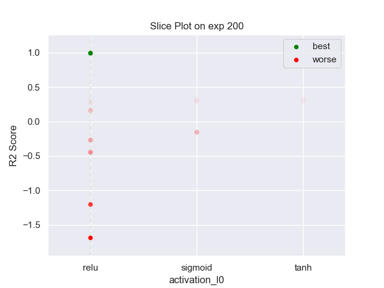
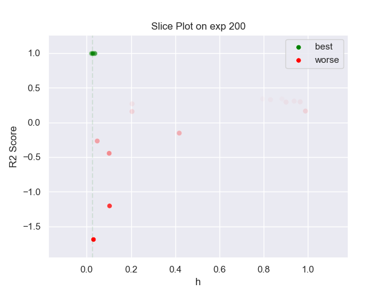

## MLP PARZEN 200 exp

### TOP 3
- R2 score: **0.99461827**
	 - **seed** : *81*
	 - **h** : *0.026604557869874756*
	 - **n_layers** : *1*
	 - **n_units_l0** : *16*
	 - **activation_l0** : *relu*
	 - **last_activation** : *lambda*
	 - **learning_rate** : *0.0017160951525772392*
	 - **epoch** : *720*
	 - **optimizer** : *Adam*
	 - **loss** : *huber_loss*
	 - **batch_size** : *68*

- R2 score: **0.99365095**
	 - **seed** : *66*
	 - **h** : *0.03495268728477334*
	 - **n_layers** : *1*
	 - **n_units_l0** : *16*
	 - **activation_l0** : *relu*
	 - **last_activation** : *lambda*
	 - **learning_rate** : *0.0015522181350109787*
	 - **epoch** : *740*
	 - **optimizer** : *Adam*
	 - **loss** : *huber_loss*
	 - **batch_size** : *68*

- R2 score: **0.99343953**
	 - **seed** : *90*
	 - **h** : *0.023010986019575033*
	 - **n_layers** : *1*
	 - **n_units_l0** : *40*
	 - **activation_l0** : *relu*
	 - **last_activation** : *lambda*
	 - **learning_rate** : *0.0011700303017998263*
	 - **epoch** : *780*
	 - **optimizer** : *Adam*
	 - **loss** : *mse_loss*
	 - **batch_size** : *76*

### WORST 3
- R2 score: **-1.68916483**
	 - **seed** : *81*
	 - **h** : *0.026604557869874756*
	 - **n_layers** : *1*
	 - **n_units_l0** : *16*
	 - **activation_l0** : *relu*
	 - **last_activation** : *lambda*
	 - **learning_rate** : *0.0017160951525772392*
	 - **epoch** : *720*
	 - **optimizer** : *Adam*
	 - **loss** : *huber_loss*
	 - **batch_size** : *68*

- R2 score: **-1.20489167**
	 - **seed** : *66*
	 - **h** : *0.03495268728477334*
	 - **n_layers** : *1*
	 - **n_units_l0** : *16*
	 - **activation_l0** : *relu*
	 - **last_activation** : *lambda*
	 - **learning_rate** : *0.0015522181350109787*
	 - **epoch** : *740*
	 - **optimizer** : *Adam*
	 - **loss** : *huber_loss*
	 - **batch_size** : *68*

- R2 score: **-0.44608771**
	 - **seed** : *90*
	 - **h** : *0.023010986019575033*
	 - **n_layers** : *1*
	 - **n_units_l0** : *40*
	 - **activation_l0** : *relu*
	 - **last_activation** : *lambda*
	 - **learning_rate** : *0.0011700303017998263*
	 - **epoch** : *780*
	 - **optimizer** : *Adam*
	 - **loss** : *mse_loss*
	 - **batch_size** : *76*

