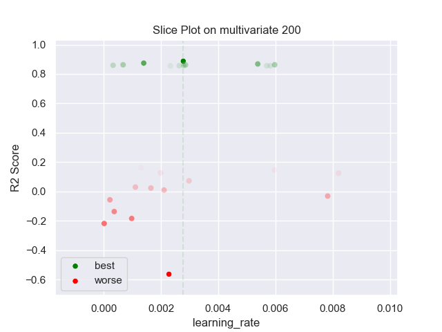

## MLP PARZEN 200 multivariate

### TOP 3
- R2 score: **0.88753345**
	 - **seed** : *12*
	 - **h** : *0.13146068251965842*
	 - **n_layers** : *2*
	 - **n_units_l0** : *14*
	 - **activation_l0** : *relu*
	 - **n_units_l1** : *44*
	 - **activation_l1** : *relu*
	 - **last_activation** : *lambda*
	 - **learning_rate** : *0.0027800000000000004*
	 - **epoch** : *850*
	 - **loss** : *huber_loss*
	 - **batch_size** : *18*

- R2 score: **0.8742172**
	 - **seed** : *25*
	 - **h** : *0.1472545675303523*
	 - **n_layers** : *2*
	 - **n_units_l0** : *20*
	 - **activation_l0** : *relu*
	 - **n_units_l1** : *44*
	 - **activation_l1** : *relu*
	 - **last_activation** : *lambda*
	 - **learning_rate** : *0.0014000000000000002*
	 - **epoch** : *810*
	 - **loss** : *huber_loss*
	 - **batch_size** : *12*

- R2 score: **0.86833425**
	 - **seed** : *69*
	 - **h** : *0.10992267568862706*
	 - **n_layers** : *2*
	 - **n_units_l0** : *42*
	 - **activation_l0** : *relu*
	 - **n_units_l1** : *28*
	 - **activation_l1** : *relu*
	 - **last_activation** : *lambda*
	 - **learning_rate** : *0.00538*
	 - **epoch** : *810*
	 - **loss** : *mse_loss*
	 - **batch_size** : *44*

### WORST 3
- R2 score: **-0.56373031**
	 - **seed** : *12*
	 - **h** : *0.13146068251965842*
	 - **n_layers** : *2*
	 - **n_units_l0** : *14*
	 - **activation_l0** : *relu*
	 - **n_units_l1** : *44*
	 - **activation_l1** : *relu*
	 - **last_activation** : *lambda*
	 - **learning_rate** : *0.0027800000000000004*
	 - **epoch** : *850*
	 - **loss** : *huber_loss*
	 - **batch_size** : *18*

- R2 score: **-0.21835425**
	 - **seed** : *25*
	 - **h** : *0.1472545675303523*
	 - **n_layers** : *2*
	 - **n_units_l0** : *20*
	 - **activation_l0** : *relu*
	 - **n_units_l1** : *44*
	 - **activation_l1** : *relu*
	 - **last_activation** : *lambda*
	 - **learning_rate** : *0.0014000000000000002*
	 - **epoch** : *810*
	 - **loss** : *huber_loss*
	 - **batch_size** : *12*

- R2 score: **-0.18424087**
	 - **seed** : *69*
	 - **h** : *0.10992267568862706*
	 - **n_layers** : *2*
	 - **n_units_l0** : *42*
	 - **activation_l0** : *relu*
	 - **n_units_l1** : *28*
	 - **activation_l1** : *relu*
	 - **last_activation** : *lambda*
	 - **learning_rate** : *0.00538*
	 - **epoch** : *810*
	 - **loss** : *mse_loss*
	 - **batch_size** : *44*

