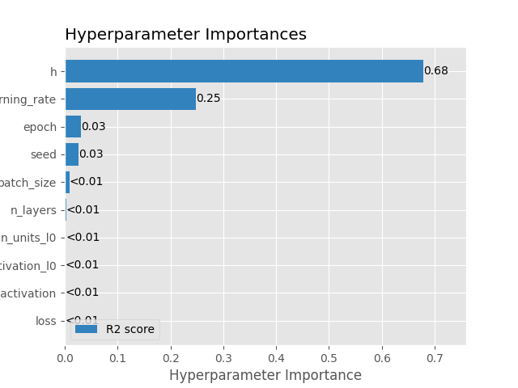
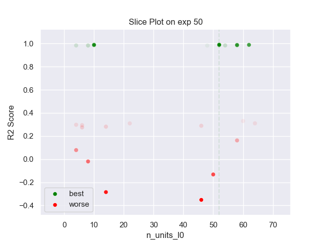

## MLP PARZEN 50 exp

### TOP 3
- R2 score: **0.99086339**
	 - **seed** : *63*
	 - **h** : *0.08920871939579947*
	 - **n_layers** : *2*
	 - **n_units_l0** : *52*
	 - **activation_l0** : *sigmoid*
	 - **n_units_l1** : *50*
	 - **activation_l1** : *tanh*
	 - **last_activation** : *None*
	 - **learning_rate** : *0.0076*
	 - **epoch** : *530*
	 - **loss** : *huber_loss*
	 - **batch_size** : *42*

- R2 score: **0.98924083**
	 - **seed** : *18*
	 - **h** : *0.06488494058137517*
	 - **n_layers** : *2*
	 - **n_units_l0** : *10*
	 - **activation_l0** : *sigmoid*
	 - **n_units_l1** : *54*
	 - **activation_l1** : *tanh*
	 - **last_activation** : *None*
	 - **learning_rate** : *0.00725*
	 - **epoch** : *500*
	 - **loss** : *huber_loss*
	 - **batch_size** : *40*

- R2 score: **0.98828882**
	 - **seed** : *62*
	 - **h** : *0.09650907792120601*
	 - **n_layers** : *2*
	 - **n_units_l0** : *62*
	 - **activation_l0** : *sigmoid*
	 - **n_units_l1** : *54*
	 - **activation_l1** : *tanh*
	 - **last_activation** : *None*
	 - **learning_rate** : *0.00692*
	 - **epoch** : *510*
	 - **loss** : *huber_loss*
	 - **batch_size** : *30*

### WORST 3
- R2 score: **-0.35185993**
	 - **seed** : *63*
	 - **h** : *0.08920871939579947*
	 - **n_layers** : *2*
	 - **n_units_l0** : *52*
	 - **activation_l0** : *sigmoid*
	 - **n_units_l1** : *50*
	 - **activation_l1** : *tanh*
	 - **last_activation** : *None*
	 - **learning_rate** : *0.0076*
	 - **epoch** : *530*
	 - **loss** : *huber_loss*
	 - **batch_size** : *42*

- R2 score: **-0.28488576**
	 - **seed** : *18*
	 - **h** : *0.06488494058137517*
	 - **n_layers** : *2*
	 - **n_units_l0** : *10*
	 - **activation_l0** : *sigmoid*
	 - **n_units_l1** : *54*
	 - **activation_l1** : *tanh*
	 - **last_activation** : *None*
	 - **learning_rate** : *0.00725*
	 - **epoch** : *500*
	 - **loss** : *huber_loss*
	 - **batch_size** : *40*

- R2 score: **-0.13227008**
	 - **seed** : *62*
	 - **h** : *0.09650907792120601*
	 - **n_layers** : *2*
	 - **n_units_l0** : *62*
	 - **activation_l0** : *sigmoid*
	 - **n_units_l1** : *54*
	 - **activation_l1** : *tanh*
	 - **last_activation** : *None*
	 - **learning_rate** : *0.00692*
	 - **epoch** : *510*
	 - **loss** : *huber_loss*
	 - **batch_size** : *30*

