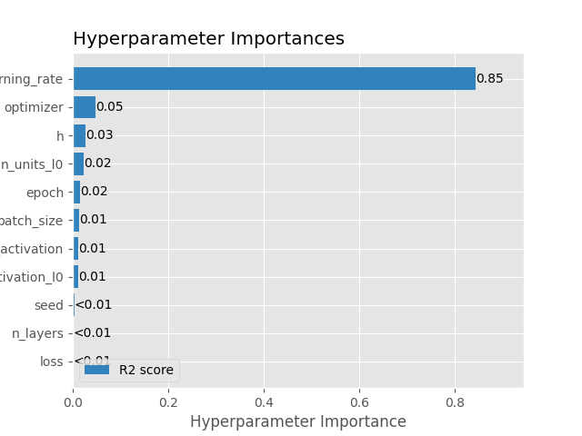
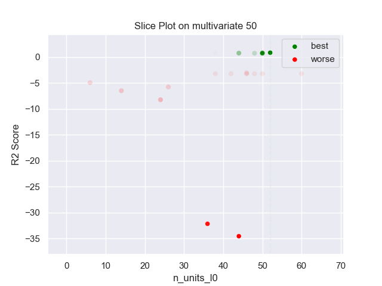
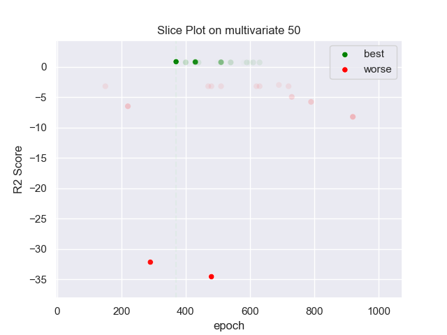
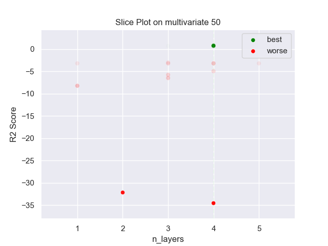
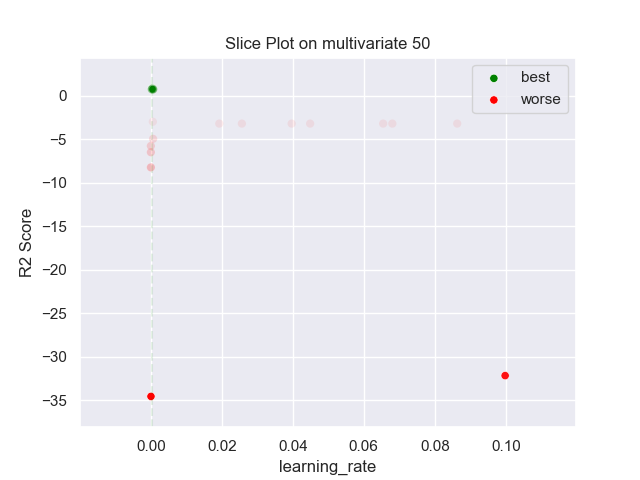
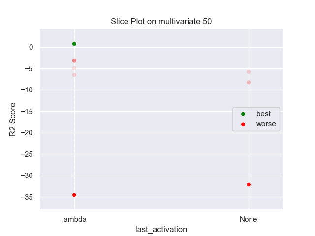
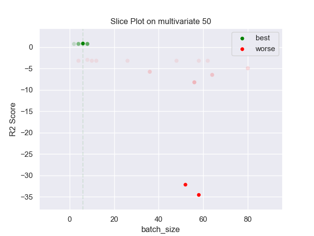
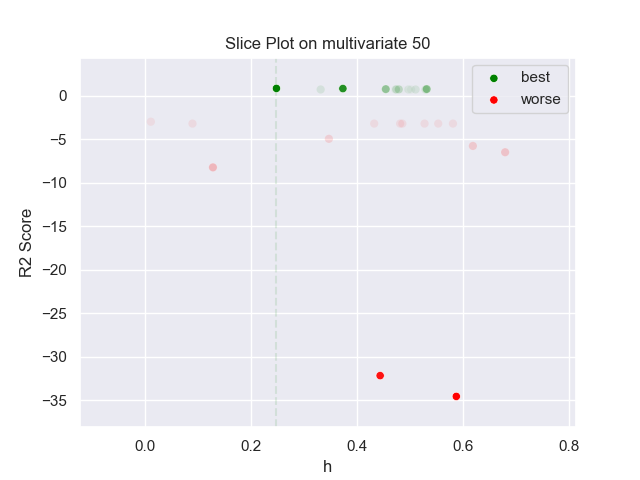

## MLP PARZEN 50 multivariate

### TOP 3
- R2 score: **0.82918059**
	 - **seed** : *64*
	 - **h** : *0.24853179838613948*
	 - **n_layers** : *4*
	 - **n_units_l0** : *52*
	 - **activation_l0** : *tanh*
	 - **n_units_l1** : *6*
	 - **activation_l1** : *tanh*
	 - **n_units_l2** : *58*
	 - **activation_l2** : *tanh*
	 - **n_units_l3** : *38*
	 - **activation_l3** : *relu*
	 - **last_activation** : *lambda*
	 - **learning_rate** : *0.00043285400651533746*
	 - **epoch** : *370*
	 - **optimizer** : *RMSprop*
	 - **loss** : *huber_loss*
	 - **batch_size** : *6*

- R2 score: **0.80969959**
	 - **seed** : *57*
	 - **h** : *0.37399657059911867*
	 - **n_layers** : *4*
	 - **n_units_l0** : *50*
	 - **activation_l0** : *tanh*
	 - **n_units_l1** : *6*
	 - **activation_l1** : *tanh*
	 - **n_units_l2** : *58*
	 - **activation_l2** : *tanh*
	 - **n_units_l3** : *14*
	 - **activation_l3** : *relu*
	 - **last_activation** : *lambda*
	 - **learning_rate** : *0.0004427545586020704*
	 - **epoch** : *430*
	 - **optimizer** : *RMSprop*
	 - **loss** : *mse_loss*
	 - **batch_size** : *6*

- R2 score: **0.74905224**
	 - **seed** : *61*
	 - **h** : *0.5322536883509457*
	 - **n_layers** : *4*
	 - **n_units_l0** : *50*
	 - **activation_l0** : *tanh*
	 - **n_units_l1** : *8*
	 - **activation_l1** : *tanh*
	 - **n_units_l2** : *52*
	 - **activation_l2** : *tanh*
	 - **n_units_l3** : *8*
	 - **activation_l3** : *relu*
	 - **last_activation** : *lambda*
	 - **learning_rate** : *0.0006900696006515737*
	 - **epoch** : *510*
	 - **optimizer** : *RMSprop*
	 - **loss** : *mse_loss*
	 - **batch_size** : *8*

### WORST 3
- R2 score: **-34.58419821**
	 - **seed** : *64*
	 - **h** : *0.24853179838613948*
	 - **n_layers** : *4*
	 - **n_units_l0** : *52*
	 - **activation_l0** : *tanh*
	 - **n_units_l1** : *6*
	 - **activation_l1** : *tanh*
	 - **n_units_l2** : *58*
	 - **activation_l2** : *tanh*
	 - **n_units_l3** : *38*
	 - **activation_l3** : *relu*
	 - **last_activation** : *lambda*
	 - **learning_rate** : *0.00043285400651533746*
	 - **epoch** : *370*
	 - **optimizer** : *RMSprop*
	 - **loss** : *huber_loss*
	 - **batch_size** : *6*

- R2 score: **-32.19507057**
	 - **seed** : *57*
	 - **h** : *0.37399657059911867*
	 - **n_layers** : *4*
	 - **n_units_l0** : *50*
	 - **activation_l0** : *tanh*
	 - **n_units_l1** : *6*
	 - **activation_l1** : *tanh*
	 - **n_units_l2** : *58*
	 - **activation_l2** : *tanh*
	 - **n_units_l3** : *14*
	 - **activation_l3** : *relu*
	 - **last_activation** : *lambda*
	 - **learning_rate** : *0.0004427545586020704*
	 - **epoch** : *430*
	 - **optimizer** : *RMSprop*
	 - **loss** : *mse_loss*
	 - **batch_size** : *6*

- R2 score: **-8.25036973**
	 - **seed** : *61*
	 - **h** : *0.5322536883509457*
	 - **n_layers** : *4*
	 - **n_units_l0** : *50*
	 - **activation_l0** : *tanh*
	 - **n_units_l1** : *8*
	 - **activation_l1** : *tanh*
	 - **n_units_l2** : *52*
	 - **activation_l2** : *tanh*
	 - **n_units_l3** : *8*
	 - **activation_l3** : *relu*
	 - **last_activation** : *lambda*
	 - **learning_rate** : *0.0006900696006515737*
	 - **epoch** : *510*
	 - **optimizer** : *RMSprop*
	 - **loss** : *mse_loss*
	 - **batch_size** : *8*

