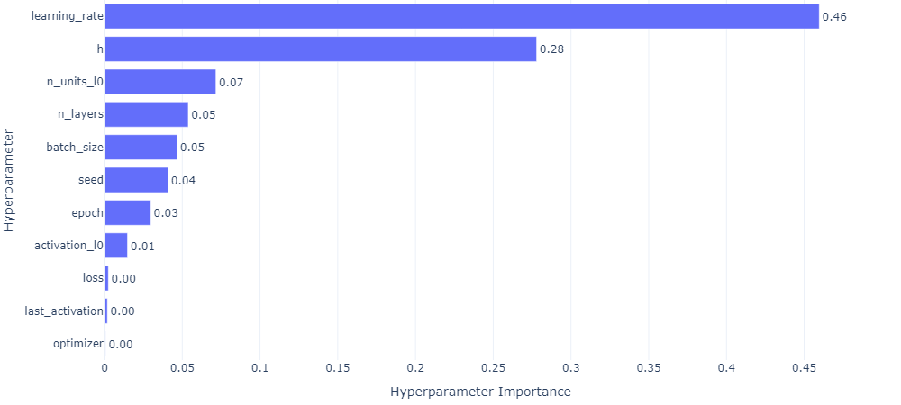

## MLP PARZEN 10

### top 3

- MLP_PARZEN_10_EXP **score=0.9351**,

  - seed: 29,
  - h: 0.13947162937819213,
  - n_layers: 1,
  - n_units_l0: 14,
  - activation_l0: sigmoid,
  - last_activation: lambda,
  - learning_rate: 0.002548269474687604,
  - epoch: 150,
  - optimizer: RMSprop,
  - loss: mse_loss,
  - batch_size: 10

- MLP_PARZEN_10_EXP **score=0.93493642**

  - seed 29,
  - h 0.12524262837912117,
  - n_layers 1,
  - n_units_l0 14,
  - activation_l0 tanh,
  - last_activation None,
  - learning_rate 0.0033405084654149087,
  - epoch 330,
  - optimizer RMSprop,
  - loss huber_loss,
  - batch_size 72

- MLP_PARZEN_10_EXP **score=0.92878824**

  - `h 0.13458231626721057`
  - `seed 8`
  - n_layers 1
  - n_units_l0 34
  - activation_l0 tanh
  - last_activation None
  - learning_rate 0.0017645973676592664
  - epoch 330
  - optimizer RMSprop
  - loss huber_loss
  - batch_size 76

### worse 3

- MLP_PARZEN_10_EXP **score=-3.40832862**,

  - seed 21, h=0.1572572740858661, n_layers 1, n_units_l0 14, activation_l0 tanh, last_activation None, learning_rate 0.00017585610969003893, epoch 320, optimizer RMSprop, loss mse_loss, batch_size 62

- MLP_PARZEN_10_EXP **score=-3.71502117**,

  - seed 21, h 0.13860025167150522, n_layers 1, n_units_l0 32, activation_l0 sigmoid, last_activation None, learning_rate 4.221128853172425e-05, epoch 600, optimizer RMSprop, loss mse_loss, batch_size 48

- MLP_PARZEN_10_EXP **score=-10.56649219**,
  - seed 14, h 0.15811727804192155, n_layers 1, n_units_l0 6, activation_l0 tanh, last_activation None, learning_rate 0.00011462848563007404, epoch 190, optimizer RMSprop, loss huber_loss, batch_size 76

